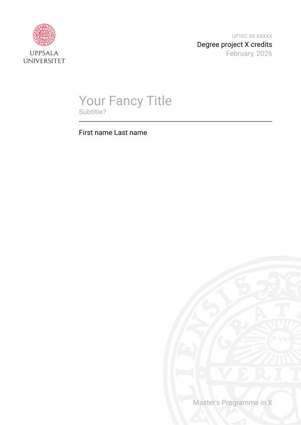
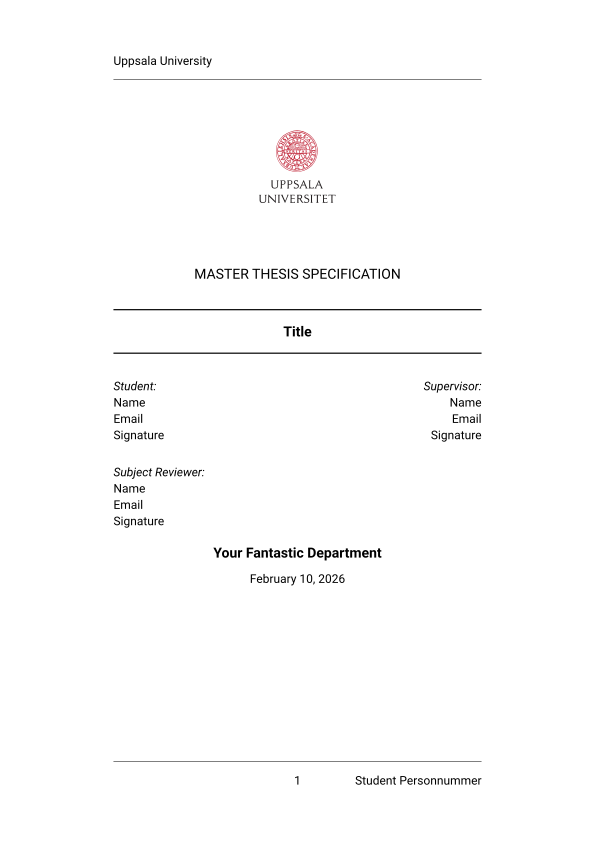

<!-- Improved compatibility of back to top link: See: https://github.com/othneildrew/Best-README-Template/pull/73 -->

<!-- PROJECT SHIELDS -->
[![Contributors][contributors-shield]][contributors-url]
[![Forks][forks-shield]][forks-url]
[![Stargazers][stars-shield]][stars-url]
[![Issues][issues-shield]][issues-url]
[![Unlicense License][license-shield]][license-url]
<!-- [![LinkedIn][linkedin-shield]][linkedin-url] -->

<!-- PROJECT LOGO -->
 

  

<h3 align="center">Uppsala University Thesis Template for Typst</h3>

  

    This is an UNOFFICIAL template for a thesis project specification and report at Uppsala University for the LaTeX replacement Typst.
     
     
    <a href="https://github.com/Pellesaxon/uu-Thesis-Templates-for-Typst/blob/main/full_report/full_report.pdf">View Demo</a>
    &middot;
    <a href="https://github.com/Pellesaxon/uu-Thesis-Templates-for-Typst/issues/new?labels=bug&template=bug-report---.md">Report Bug</a>
    &middot;
    <a href="https://github.com/Pellesaxon/uu-Thesis-Templates-for-Typst/issues/new?labels=enhancement&template=feature-request---.md">Request Feature</a>
  

<!-- ABOUT THE PROJECT -->
## About The Project
This is an UNOFFICIAL thesis template for [Typst](https://typst.app/). Typst is a typesetting language similar to LaTeX but based on the markup syntax (similar to markdown). It's designed to be as powerful as LaTeX while being easier to learn and use. 

The report template is a port of the [Uppsala University Thesis Template](https://sv.overleaf.com/latex/templates/uppsala-university-thesis-template/sptrqrdhcdxz) for LaTeX which in turn is based on the [Mall – Kandidatarbete i teknisk fysik (Uppsala universitet)](https://sv.overleaf.com/latex/templates/mall-kandidatarbete-i-teknisk-fysik-uppsala-universitet/hcvpscsrypvt). The thesis proposal is a port of the [Thesis Specifacation Template](https://www.overleaf.com/latex/templates/thesis-specifacation-template/jvcjpqghxnnf). Therefore, the credit goes to the original creators.

The template is only a template so be sure to refer to your specific thesis guidelines! The guidelines that I have referred to when creating the report template came from the [Department of Information Technology 2024](https://drive.google.com/file/d/1MiRDrHPS6KqsqCOAj5OMmXrB76NSXlu1/view). 

(<a href="#readme-top">back to top</a>)

## Examples

  
  

(<a href="#readme-top">back to top</a>)

<!-- GETTING STARTED -->
## Getting Started
To use this template you just need to download the project and either 

* Tyspt webapp
  1. Download or fork the repository 
  2. Create an empty project at [Typst](https://typst.app/)
  3. Upload all files into the project and you're off

* VSCode
  1. Download or fork the repository 
  2. Install the [Tinymist Typst Extension](https://marketplace.visualstudio.com/items?itemName=myriad-dreamin.tinymist) for preview, compiling and more
  3. Install [LTeX+ Extension](https://marketplace.visualstudio.com/items?itemName=ltex-plus.vscode-ltex-plus) for spellchecking
  4. Open the repository and you're off

For other solutions check online for what possibilities exits for your preferred editor. I know Vim is a popular option. 

(<a href="#readme-top">back to top</a>)

<!-- USAGE EXAMPLES -->
## Usage

For usage tips check the appendix tips at the end of the templates. There you can find info on syntax, styling as well as other considerations. There are also a lot of inline comments in the templates that explain what different code sections do that can be delved into to change the styling according to your preferences.

(<a href="#readme-top">back to top</a>)

<!-- ROADMAP -->
<!-- ## Roadmap

- [ ] Feature 1
- [ ] Feature 2
- [ ] Feature 3
    - [ ] Nested Feature

See the [open issues](https://github.com/Pellesaxon/uu-Thesis-Templates-for-Typst/issues) for a full list of proposed features (and known issues).

(<a href="#readme-top">back to top</a>)
 -->

<!-- CONTRIBUTING -->
## Contributing

Any contributions you make are **greatly appreciated**. This is my first large scale Typst project and thus there might be errors or options I have failed to consider. 

If you have a suggestion that would make this better, please fork the repo and create a pull request. You can also simply open an issue with the tag "enhancement". I try to be active, but it might take multiple days to respond. 
Don't forget to give the project a star! Thanks again!

1. Fork the Project
2. Create your Feature Branch (`git checkout -b feature/AmazingFeature`)
3. Commit your Changes (`git commit -m 'Add some AmazingFeature'`)
4. Push to the Branch (`git push origin feature/AmazingFeature`)
5. Open a Pull Request

(<a href="#readme-top">back to top</a>)

<!-- ### Top contributors:

 -->

<!-- LICENSE -->
## License

Distributed under the Unlicense License. See `LICENSE.txt` for more information.

(<a href="#readme-top">back to top</a>)

<!-- CONTACT -->
## Contact

Oskar Perers - oskar.perers@gmail.com

Project Link: [https://github.com/Pellesaxon/uu-Thesis-Templates-for-Typst](https://github.com/Pellesaxon/uu-Thesis-Templates-for-Typst)

(<a href="#readme-top">back to top</a>)

<!-- ACKNOWLEDGMENTS
## Acknowledgments

* 
* 
* 

(<a href="#readme-top">back to top</a>)
 -->

<!-- MARKDOWN LINKS & IMAGES -->
<!-- https://www.markdownguide.org/basic-syntax/#reference-style-links -->
[contributors-shield]: https://img.shields.io/github/contributors/Pellesaxon/uu-Thesis-Templates-for-Typst.svg?style=for-the-badge
[contributors-url]: https://github.com/Pellesaxon/uu-Thesis-Templates-for-Typst/graphs/contributors
[forks-shield]: https://img.shields.io/github/forks/Pellesaxon/uu-Thesis-Templates-for-Typst.svg?style=for-the-badge
[forks-url]: https://github.com/Pellesaxon/uu-Thesis-Templates-for-Typst/network/members
[stars-shield]: https://img.shields.io/github/stars/Pellesaxon/uu-Thesis-Templates-for-Typst.svg?style=for-the-badge
[stars-url]: https://github.com/Pellesaxon/uu-Thesis-Templates-for-Typst/stargazers
[issues-shield]: https://img.shields.io/github/issues/Pellesaxon/uu-Thesis-Templates-for-Typst.svg?style=for-the-badge
[issues-url]: https://github.com/Pellesaxon/uu-Thesis-Templates-for-Typst/issues
[license-shield]: https://img.shields.io/github/license/Pellesaxon/uu-Thesis-Templates-for-Typst.svg?style=for-the-badge
[license-url]: https://github.com/Pellesaxon/uu-Thesis-Templates-for-Typst/blob/master/LICENSE.txt
<!-- [linkedin-shield]: https://img.shields.io/badge/-LinkedIn-black.svg?style=for-the-badge&logo=linkedin&colorB=555
[linkedin-url]: https://linkedin.com/in/linkedin_username -->
[product-screenshot-report]: dependencies/full_report_first_page.svg 
[product-screenshot-proposal]: dependencies/thesis_specification_first_page.svg 

<!-- Shields.io badges. You can a comprehensive list with many more badges at: https://github.com/inttter/md-badges -->
